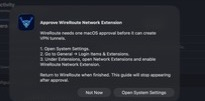
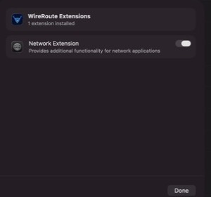

# Approve WireRoute after installing the signed macOS DMG

This approval is required only for the Developer ID build distributed in the signed WireRoute DMG. The Mac App Store build uses Apple's app-extension distribution path and does not install this separate system extension.

WireRoute opens normally while approval is pending and displays this guide on each launch until macOS enables the extension:

## Enable the extension

1. Drag **WireRoute.app** from the DMG into **Applications**, then open it from Applications.
2. In WireRoute's approval guide, select **Open System Settings**.
3. In System Settings, go to **General → Login Items & Extensions**.
4. In the Extensions section, open **Network Extensions**.
5. Enable **Network Extension** under **WireRoute Extensions**, then select **Done**.
6. Return to WireRoute. If macOS says a restart is required, restart the Mac before connecting a profile.

The enabled setting looks like this:

WireRoute does not install a daemon, launch service, or privileged helper for tunnel persistence. The system extension is Apple's supported Network Extension host for the Developer ID build. Profile-specific automatic reconnection remains controlled by each profile's **On-Demand** settings.

## If the guide keeps returning

- Confirm that WireRoute is running from **Applications**, not directly from the mounted DMG.
- Reopen **System Settings → General → Login Items & Extensions → Network Extensions** and confirm the WireRoute switch is on.
- Quit and reopen WireRoute after enabling the extension.
- If macOS reports that activation will complete after a restart, restart before trying to connect.

For additional help, see [SUPPORT.md](../SUPPORT.md).
